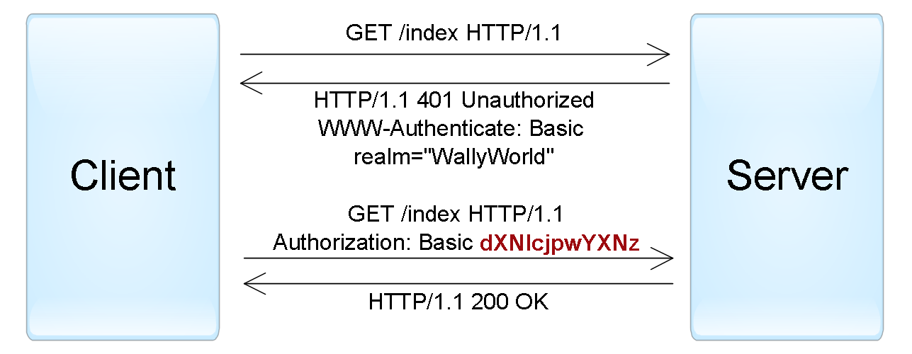
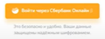
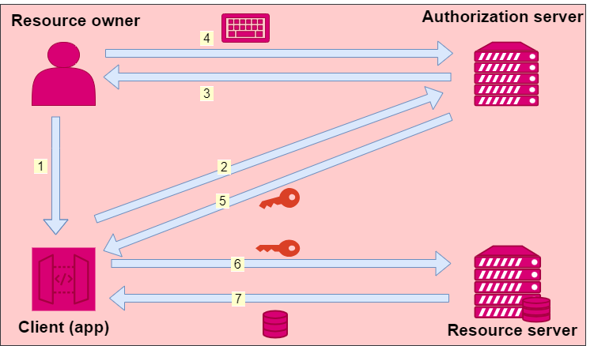
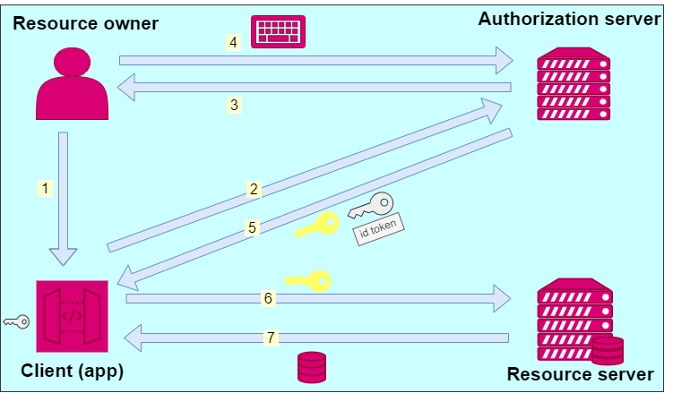

### Терминология
- **`Идентификация`** - это заявление о том, кем вы являетесь. В зависимости от ситуации, это может быть имя, адрес электронной почты, номер учетной записи, итд.;
- **`Аутентификация`** -  предоставление доказательств, что вы на самом деле есть тот, кем идентифицировались (от слова “authentic” — истинный, подлинный).;
- **`Авторизация`** - -   проверка, что вам разрешен доступ к запрашиваемому ресурсу.

---
|     **Способ**|**Основное применение**|**Протоколы**|
|----------------|-------------------------------|-----------------------------|
|**По паролю**| Аутентификация пользователей |  HTTP, Forms|
|**По сертификатам**|Аутентификация пользователей в безопасных приложениях; аутентификация сервисов| SSL/TLS|
|**По одноразовым паролям**|Дополнительная аутентификация пользователей (для достижения two-factor authentication)|Forms|
|**По ключам доступа**|Аутентификация сервисов и приложений|-|
|**По токенам**|Делегированная аутентификация пользователей; делегированная авторизация приложений|SAML, WS-Federation, OAuth, OpenID Connect|
---

## Basic
Наиболее простая схема, при которой `username` и `password` пользователя передаются в заголовке `Authorization` в незашифрованном виде (**base64-encoded**). Однако при использовании HTTPS (HTTP over SSL) протокола, является относительно безопасной.

---
 **JSON Web Token (JWT)** — содержит три блока, разделенных точками: заголовок, набор полей (claims) и подпись. Первые два блока представлены в JSON-формате и дополнительно закодированы в формат base64. Набор полей содержит произвольные пары имя/значения, притом стандарт JWT определяет несколько зарезервированных имен (iss, aud, exp и другие). Подпись может генерироваться при помощи и симметричных алгоритмов шифрования, и асимметричных. Кроме того, существует отдельный стандарт, отписывающий формат зашифрованного JWT-токена.  
  
_Пример подписанного JWT токена (после декодирования 1 и 2 блоков)._  

> { «alg»: «HS256», «typ»: «JWT» }.  
> { «iss»: «[auth.myservice.com](http://auth.myservice.com/)», «aud»: «[myservice.com](http://myservice.com/)», «exp»: «1435937883», «userName»: «John Smith», «userRole»: «Admin» }.  
> S9Zs/8/uEGGTVVtLggFTizCsMtwOJnRhjaQ2BMUQhcY

## Войти через..

* Провайдерами аутентификации могут выступать организации, проверившие пользователя!
* Конечно, информация может быть передана только с согласия самого клиента

Для этого как раз существует экран согласия, который вы иногда видите, используя “вход через
какой-либо сервис.

OPENid - это слой учетных данных поверх OAuth 2.0 (делегированная авторизация),  здесь появляется `id-token` и информация о пользователе.

**`id-token`** содержит информацию о пользователе.

**`access-token`**  - ключ позволяющий получить доступ к удаленным ресурсам. Имеет ограниченное время жизни. Хранится в `LocalStorage`.

**`refresh=token`** - живет более долго (30 дней например), необходим для обновления access-токена. Хранится в куках.

OAuth 2.0

>OAuth используется для:
> - Предоставления доступа к API;
> - Получения данных пользователя в других системах.

OpenID

> OpenID используется для аутентификации пользователя.

Сайт, получив токен доступа для пользователя, может выполнить с ним запрос к Authorization Server (**OIDS**) для получения информации о пользователе (_доступную, разрешенную информацию_).
* Доступ к информации управляется через Sсореs
* Sсореs вшиты в токен доступа, и выдаются OIDS

> **`Sсоре`** — некое мнемоническое имя, имеющее значение в определенных контекстах

Примеры:
* profile,
* email

Сайту по сути не нужен ассеss Tокеn, если он не обращается к внешним сервисам от лица клиента, но он нужен для получения дополнительной информации от сервера авторизации о пользователе.

**Роль фронта** - хранение токена, отправка токена, обновление токена.

---

https://habr.com/ru/companies/dataart/articles/262817/

https://deworker.pro/edu/series/http-basics/authentication-headers

https://www.youtube.com/watch?v=fN25fMQZ2v0&ab_channel=UlbiTV

https://www.youtube.com/watch?v=kHL-zwEuSQo&ab_channel=SergeiCalabonga

https://www.youtube.com/watch?v=i7vuFHH0nxY&ab_channel=DotNetRu

