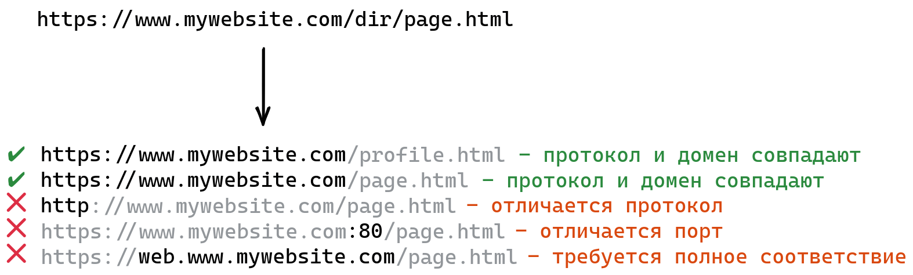
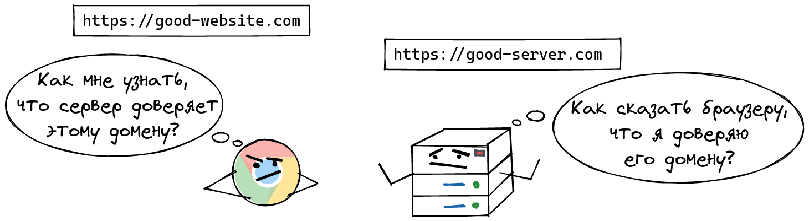

### CORS ### 
___О средствах защиты браузера и о том, что он может от нас скрывать в процессе кроссдоменных запросов.___

В тех случаях, когда запрос отправляется на ресурс, 
у которого отличается `домен` / `порт` / `протокол` – браузер по умолчанию понимает, 
что он кроссдоменный и применяет политику безопасности:

`CORS` – Cross Origin Resource Sharing (совместное использование ресурсов между источниками).

Что же делать в том случае, когда нам необходимо разрешить для браузера взаимодействие между различными ресурсами?

Браузер должен отправить в запросе заголовок:

**origin: htttps://good-website.com**

Сервер проверит, откуда к нему пришёл запрос, и (если этот домен разрешён) в ответе вернёт заголовок:

**access-control-allow-origin: htttps://good-website.com**

https://vc.ru/dev/430112-cors-prosto-i-ponyatno-govorim-pro-oshibki-krossdomennyh-zaprosov

https://habr.com/ru/company/macloud/blog/553826/

https://developer.mozilla.org/ru/docs/Web/HTTP/CORS