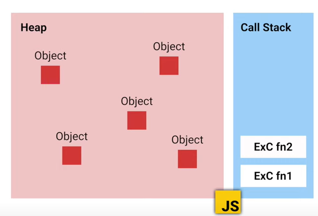
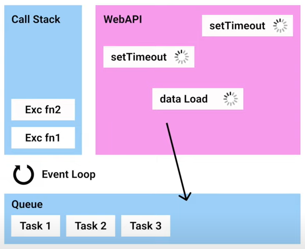
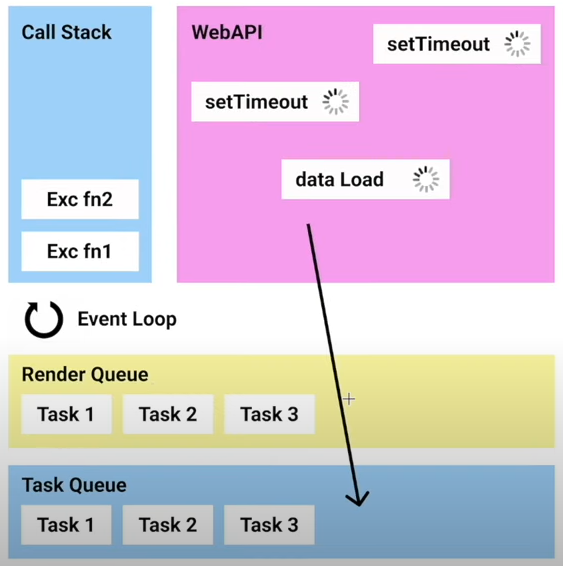
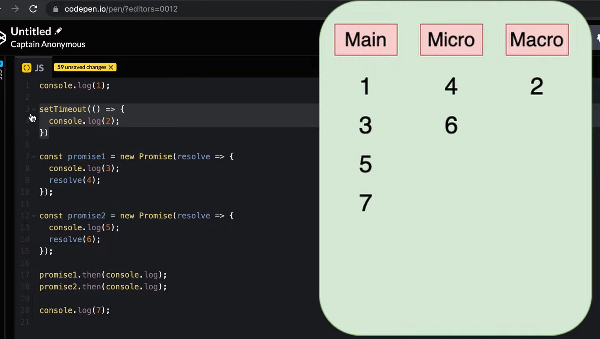
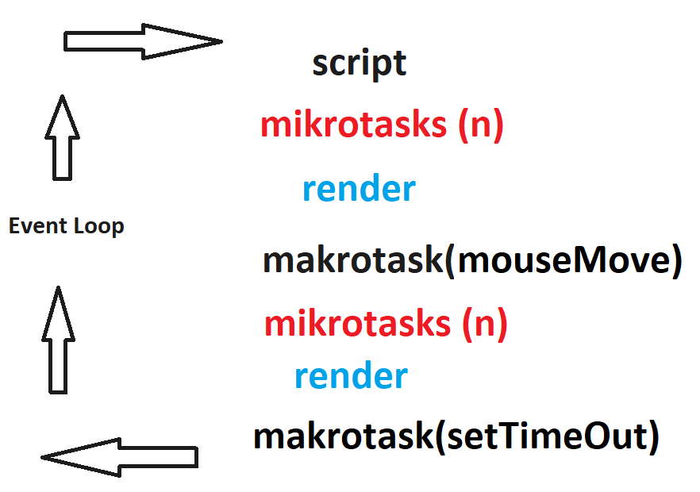

## Event LOOP ##

JS - однопоточный язык программирования, т.е. в 1 единицу времени может выполнять 1 операцию.
Он состоит из HEAP и Call Stack под копотом.

Call Stack предназначен для функций.Когда мы вызываем каждую функцию в Call Stack помещается `Executor Context` (контекст выполнения) функции.
И только после того, как она отработает, удаляется из `стека`.
Стэк - структура данных, которая представляет собой последовательность LIFO(FIFO) - первый вошел - первый вышел.

`HEAP` - область с памятью в JS, где хранятся все объекты и т.д.

### ЕvenlLoop ###

`Event Loop` берется в связке когда уже JS запускается в браузере и у него добавляются механизмы которые он может использовать.

`WebAPI` - область JS для работы с ассинхронностью (+объект Window).

После отработки ассинхронной операции она помещается в очередь `Queue` (FIFO). После того, как стэе вызовов у JS свобождается, `Event Loop` помещает в нее `Queue tasks` (макрозадачи) по 1.

Задача `Event Loop` следить за очищенностью `Call stack` и перемещать туда по 1 макрозадаче. 

Максимальный размер `Call stack` ~ около 10k элементов. Некоторые движки до 100к. Убедиться можно запутив бесконечную рекурсию - получим ошибку `Maximum call stack size exceeded` (заполнилась память по стэку).

Блокировать выполнение кода можно при помощи `alert`,`prompt`, `confirm`, либо синхронными запросами.
Чтобы избежать переполнения стэка вызовов необходимо использовать асинхронные операции (в WebAPI).

__Микрозадачи__ 

Микрозадачи приходят только из кода. Обычно они создаются `Промисами`: выполнение обработчика `.then / catch / finally` становится микрозадачей. + `Await`.

Также есть специальная функция `queueMicrotask(func)`, которая помещает func в очередь микрозадач.

Есть еще некая дополнительная очередь `render`. Когда механизмы в браузере отрабатывают перерисовки.

__Сразу после каждой макрозадачи движок исполняет все задачи из очереди микрозадач перед тем, как выполнить следующую макрозадачу или отобразить изменения на странице, или сделать что-то ещё.__

__Все микрозадачи завершаются до обработки каких-либо событий или рендеринга, или перехода к другой макрозадаче.__
> ! ___Это важно. Т.к. гарантирует, что общее окружение остаётся одним и тем же между микрозадачами – не изменены координаты мыши, не получены новые данные по сети и т.п.___

Очередь микрозадач называется Queue microtasks.

addEventListener(...), вызов других скриптов тоже помещаются в WebAPI.

>Все, что внутри промиса выполняется в основном потоке кода.

Источники

https://learn.javascript.ru/event-loop

https://youtu.be/3naT39judvQ

https://youtu.be/KAt4U98UfPE