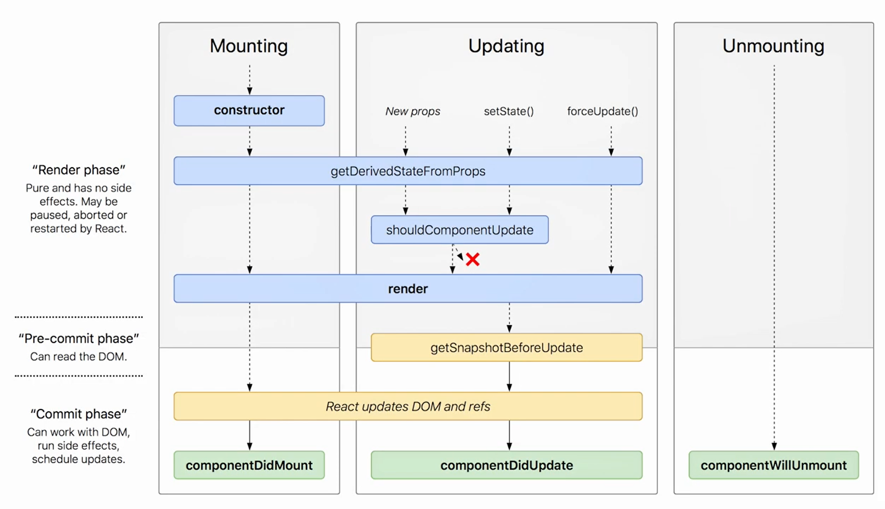
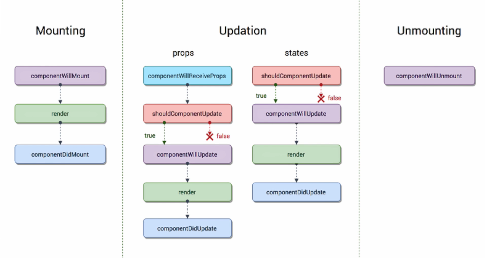
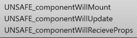

#### Порталы ####
Порталы позволяют рендерить дочерние элементы в DOM-узел, который находится вне Dom-иерархии родительского компонента.

### Hooks ###

\* __useState__ позволяет работать с состоянием переменных внутри функционального компонента.
Для __определения__ состояния переменной необходимо вызвать useState с начальным состоянием в качестве аргумента: `useState(initialValue)`.
Для __обновления__ состояния переменной необходимо вызвать функцию обновления возвращаемую useState: const [state, setState] = useState(initialValue).

\* __useEffect__ принимает функцию, отвечающую за дополнительные (побочные) эффекты и зависимости.
Если в качестве зависимости пустой массив [], то `callback` выполнится 1 раз при 1-м рендеринге.
Если передать значение, то `callback` будет вызывать при каждом изминении этой зависимости.
Если зависимость не передать, то `callback` будет отрабатывать при каждом рендеринге.

Часто используют для удаления `AddEventListener`.

> Функция, передаваемая в useEffect, вызывается после рендеринга страницы,


\* __useLayoutEffect__. 
   Поведение useLayoutEffect аналогично поведению useEffect, за некоторым исключением.
>  Функция, передаваемая useLayoutEffect, вызывается перед рендерингом страницы.

Если вы например, хотите осуществить некоторые манипуляции с DOM в качестве дополнительного эффекта, useEffect не лучший выбор. Для того, чтобы пользователь не видел изменений, следует использовать `useLayoutEffect`.   

\* __useReducer__ может использоваться как альтернатива useState, однако, его назначение состоит в инкапсуляции сложной логики работы с состояниями, когда состояние зависит от предыдущего значения или имеется несколько состояний.

\* __useCallback__ возвращает сохраненный (кэшированный) колбэк при ререндеринге, если не менялись зависимости.

> useCallback массив зависимостей обязателен

\* __useMemo__ возвращает сохраненное (кэшированное) значение.

> useMemo аргумент-функция не принимает параметры.
> В useMemo не рекомендуется использовать другие хуки.

> useMemo вызывается исходниками React'а, а useCallback - вызываем мы.

\* __useRef__ возвращает объект ref. 

Значения этого объекта доступны через свойство «current». 
Данному свойству может присваиваться начальное значение: useRef(initialValue). 
Объект ref существует на протяжении жизненного цикла компонента.

Объект `ref` может содержать любое значение, а не только указатель на `DOM-элемент`.
   
   Базовое использование:
В представленном ниже примере вместо useState используется useReducer. Вызов useReducer возвращает значение состояния и функцию `dispatch`.
```
 const [state, dispath] = useReducer(reducer, initialState);
```


\* __useContext__ избавляет от необходимости полагаться на потребителя контекста. Он имеет более простой интерфейс по сравнению с MyContext.Consumer и рендеринг пропсов. 

Ниже представлено сравнение использования контекста с помощью useContext и Context.Consumer.
```   
   // пример использования объекта Context
   const ThemeContext = React.createContext("dark")
   
   // использование потребителя контекста
   function Button() {
       return (
           <ThemeContext.Consumer>
               {theme => <button className={thene}>Восхитительная кнопка!</button>}
           </ThemeContext.Consumer>
   }
   
   // использование useContext
   import { useContext } from "react"
   
   function ButtonHook() {
       const theme = useContext(ThemeContext)
       return <button className={theme}>Восхитительная кнопка!</button>
   }
```

---
### Источники ###
https://3-info.ru/post/21421 

### HOC ###

__Компонент высшего порядка(HOC)__ в React это паттерн, используемый для того, чтобы __делить функционал между компонентами без повторения кода__. 

По факту, они не совсем являются компонентами, это скорее функции. 
Такая функция берёт компонент, как аргумент и отдаёт уже готовый компонент. 
Она переделывает заданный компонент в другой компонент и добавляет дополнительные данные, либо фунционал. 

```
const NewComponent = (BaseComponent) => {
  // ... создает новый компонент, обновляя старый и отдавая результат
}
```

Пример:

Вот компонент более высокого порядка, который преобразует и возвращает имена пользователей в верхнем регистре:
```
const hoc = (WrappedComponent) => (props) => {
  return (
    <div>
      <WrappedComponent {...props}>
        {props.children.toUpperCase()}
      </WrappedComponent>
    </div>
  )
}
```
Этот компонент более высокого порядка принимает в качестве аргумента WrappedComponent. 
Затем он возвращает новый компонент с переданными ему реквизитами, создавая элемент React. 
Мы вызываем `.toUpperCase()` для `props.children`, чтобы преобразовать переданные `props.children` в верхний регистр.

Чтобы использовать этот компонент более высокого порядка, нам нужно создать компонент, который принимает реквизит и отображает дочерние компоненты.
```
const Username = (props) => (
  <div>{props.children}</div>
)
```

Затем мы оборачиваем Username в компонентом более высокого порядка. Давайте сохраним это в переменной:

```
const UpperCaseUsername = hoc(Username)
```

Мы теперь можем использовать его следующим образом в компоненте App:

```
const App = () => (
  <div>
    <UpperCaseUsername>Kingsley</UpperCaseUsername>
  </div>
);
```

- ___Компоненты высшего порядка должны быть чистыми функциями без сайд эффектов. Они не должны делать никаких изменений, а просто формировать изначальный компонент, обертывая его другим компонентом.___

- Не используйте HOC в рендере компонента. Получайте доступ к HOC только за пределами определения компонента.

- `Ref`-ы не передаются. Использовать forwardRef.


### Источники ###

HOC:

https://youtu.be/POHukHTiEL4

https://webformyself.com/chto-takoe-komponenty-vysshego-poryadka-v-react/

https://stasonmars.ru/javascript/ponimaem-komponenty-vysshego-poryadka-v-react-na-realnom-primere/


### Pure Components ###
`Pure Components` (чистые компоненты). 
Компонент является `чистым` если он гарантировано возвращает 1 и тот же результат при одинаковых `пропсах` и `состояниях`.
Чистые компоненты имеют улучшеную производительность за счет поверхностного сравнения `props` и `state`.

Для классовых компонентов:
1) Есть метод ЖЦ __`shouldComponentUpdate`__ - это необязательный метод. Внутри метода проверяется логикой текущие и предыдущие значения `props`, `state` и на основе сравнения возвращает true / false  Если он возвращает `false`, то React пропустит рендеринг компонента.
2) Так же есть класс `React.PureComponent`. Он может использоваться вместо обычного класса (`React.Component` в связке с __`shouldComponentUpdate`__). Т.e `PureComponent` || `Component` + __`shouldComponentUpdate`__.

Для функциональных компонентов можно исп-ть `React.Memo` - это `HOC` (функция высшего порядка). Он принимает компонент и возвращает компонент, __по-умолчанию сравнение происходит поверхностное__. По мимо компонента, вторым аргументом может принимать функцию сравнения (кастомную). Memo


### Методы жизненного цикла ###


__Mounting__ - Монтирование компонента в DOM-дерево (его 1-е появление).
__Updation__ - Обновление компонента (перерендеринг).
__Unmounting__ - размонтирование компонента из DOM(Удаление компонента).

Новые методы (с 16.3)

1) __getDerivedStateFromProps__ - задача метода убедиться, что `states`, `props` синхронизированы  (замена `ComponentWillReceiveProps`).

2) __shouldComponentUpdate__ - вызывается в `pre-commit phase`, то есть прямо перед изменениями V-DOM, которые должны быть отображены в DOM.   
Этот метод можно использовать когда необходимо получить текущее состояние DOM.

3) __ComponentDidCatch__ - позволяет реагировать на события в дочернем компоненте, в т.ч. любые ошибки в дочерних компонентах.


до 16.3

Mounting:
0) Сonstructor
1) ComponentWillMount (___depricated___) - использовался для отправки запросов на получение данных для компонента. 
> -: запрос не успевал выполняться до рендеринга. ИЗ-за этого рендеринг выполнялся повторно.
2) ComponentDidMount - будет вызываться только 1 раз после 1-ой отрисовки компонента.
И будет сообщать, что сам компонент и все его дочерние компоненты отрисовались без ошибок.
Идеальное место для `side`эффектов.

Updation:
1) __ComponentWillReceiveProps__ (___depricated___) - метод вызывается когда компонент получает новые `props`.
Метод получает аргумент `nextProps`, который является объектом с обновленными пропсами и пропсами, которые не обновились.

2) __shouldComponentUpdate__ - метод отвечает на вопрос: должен ли компонент обновиться? Возвращает `true` / `false`. 
Внутри нельзя вызывать `setState`.

3) __ComponentWillUpdate__ (___depricated___) - используется для синхронизации между `states` и `props`. Если не использовать `shouldComponentUpdate`.
Он может быть вызван несколько раз перед рендерингом, не стоит выполлнять sideEffects, особенно запросы.  

4) __ComponentDidUpdate__ - вызывается после перерисовки компонента. Все `side`-эффекты следует выполнять именно здесь. 

Unmounting:

1) __ComponentWillUnmount__ 
Используется для очистки компонента, т.е. если он использует например `setTimeout`, `setInterval`.



Устаревшие методы можно использовать используя префикс UNSAFE.