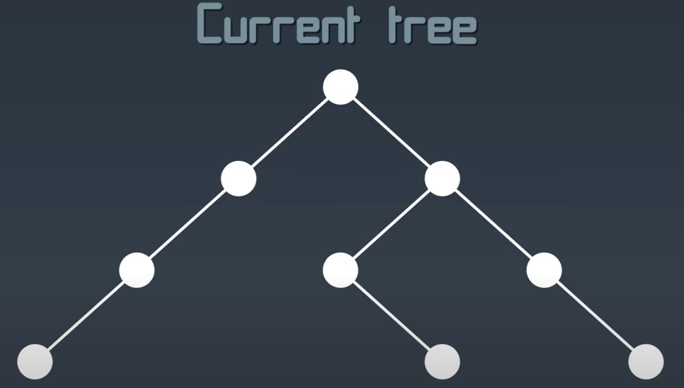
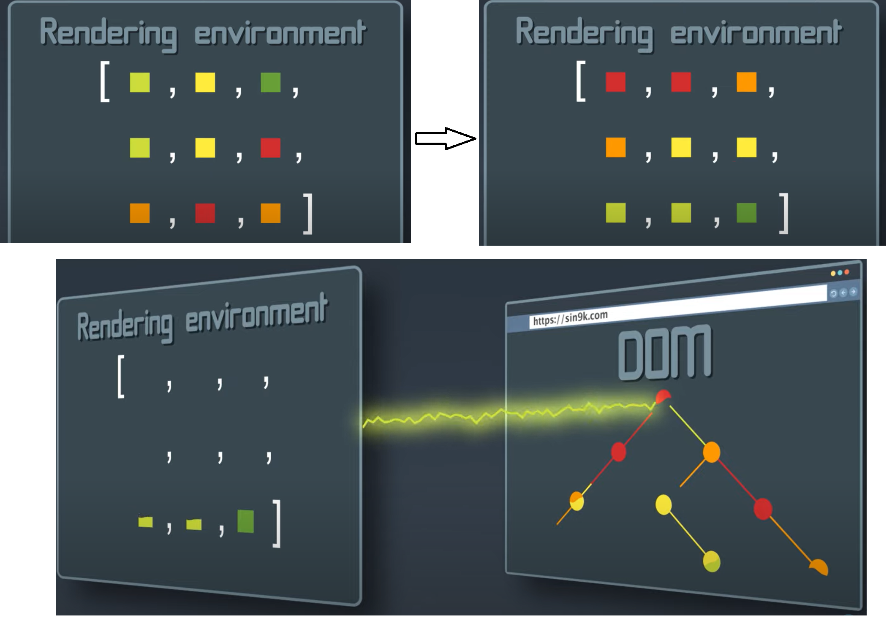
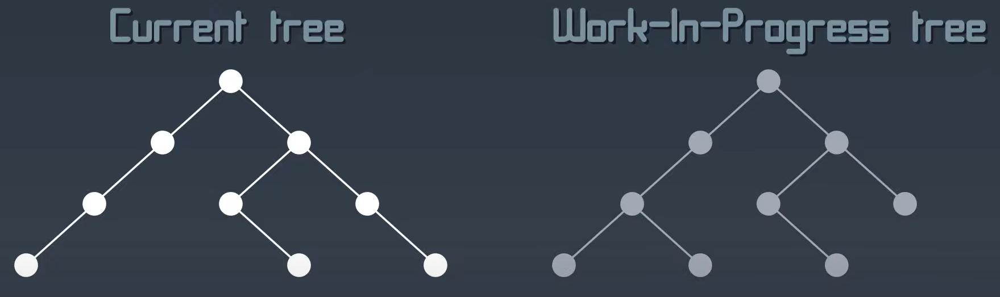
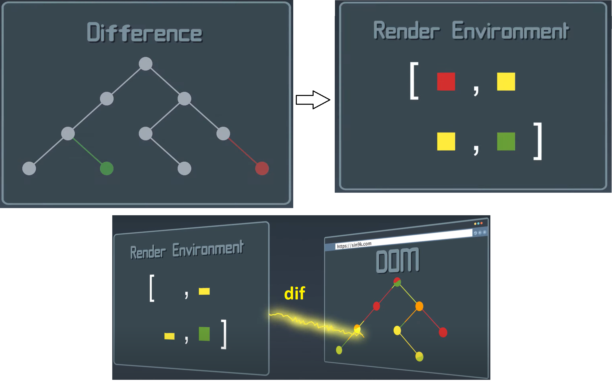
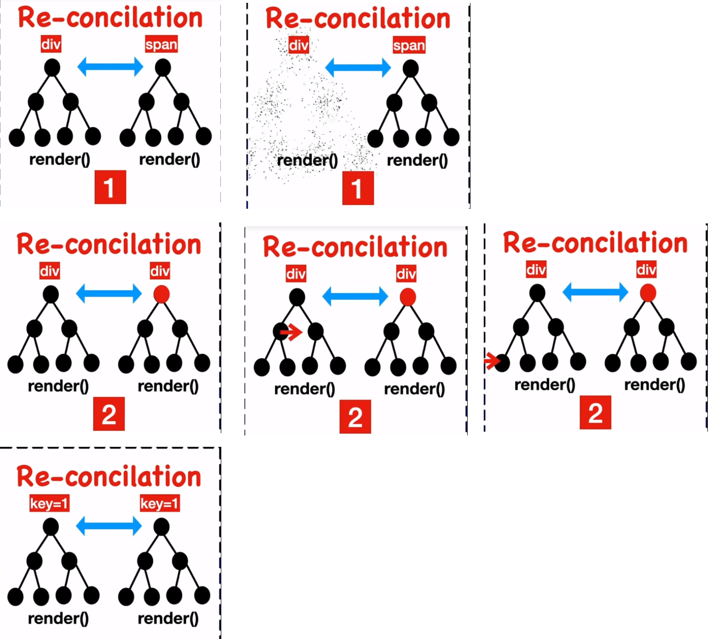
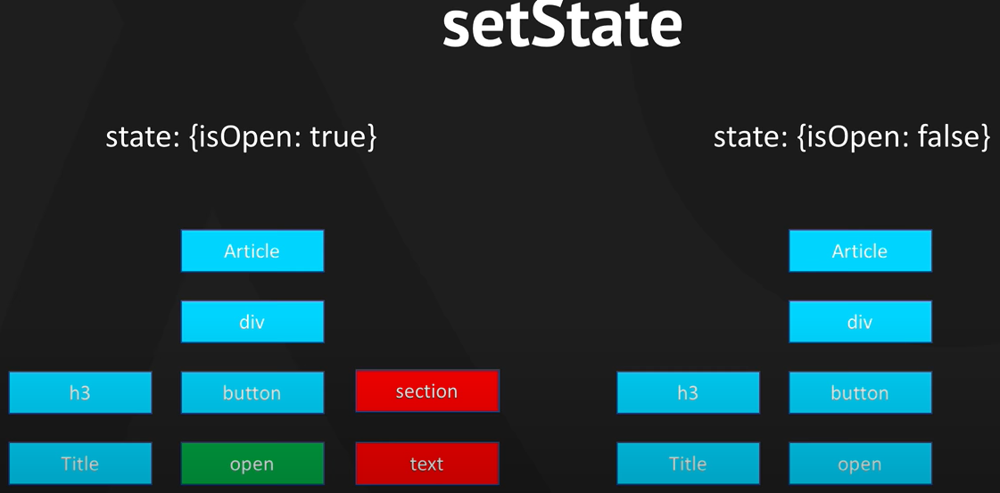

`DOM` (аббревиатура от Document Object Model) — способ представления структурного документа с помощью объектов.

Главная проблема DOM — он никогда не был рассчитан для создания динамического пользовательского интерфейса (UI). 
Мы можем работать с ним, используя JavaScript и библиотеки jQuery, но их использование не решает проблем с производительностью.

__Virtual DOM__ (React)

Вместо того, чтобы взаимодействовать с `DOM` напрямую, мы работаем с его легковесной копией. 
Мы можем вносить изменения в копию, исходя из наших потребностей, а после этого применять изменения к реальному DOM.
При этом происходит сравнение `DOM-дерева` с его `виртуальной` копией, определяется разница и запускается перерисовка того, что было изменено.

Что делает этот подход действительно быстрым:
- Эффективные алгоритмы сравнения;
- Группировка операций чтения/записи при работе с DOM;
- Эффективное обновление только под-деревьев.

1. Итак, все начинается с `Node` (узел). 
Из них в совокупности при помощи метода `.render` собирается дерево `React-элементов`, которое описывает все состояние приложения и хранится в памяти. 

Далее это дерево попадает в `Rendering enviroment` (среду рендеринга) . В Web среда переведет это дерево в набор операций для отрисовки текущих изменений.
При этом будет выполнена приоритизация DOM-операций по срочности их попадания к пользователю.

 При 1-м загрузке сайта среда рендерина (`Rendering environment`) отрисовывает полностью `Dom-дерево.`

При дальнейших действиях пользователя (нажатие по кнопке) происходят изменения на сайте
 и как результат строится новое дерево __`Work-in-Progress tree`__.
 

После чего они сравниваются.
  
Разница полученная при сравнении отправляется в __`RenderEnvironment`__ где сортируется по приоритезации и выполняется частичный рендеринг DOM операций в реальное `DOM-дерево`.

После этого `Work-in-Progress` дерево становится `Current` деревом.

### Глубже ###
 Существует несколько решений алгоритмической проблемы трансформации одного дерева в другое за min количество операций, соответственно и времени.
 
 Тем не менее передовые алгоритмы имеют сложность порядка: <pre>o(n3)</pre>, где `n` - число элементов в дереве.
 
 При 1000 `nodes` алгоритм потребует 1 млрд сравнений.
 
 Разработчики `React` выбрали варистический метод порядка `o(n)` => при 1000 nodes = 1000 сравнений.
 
 >  Эвристический метод - алгоритм решения задачи включающий практический метод, не являющийся гарантировано точным или оптимальным. 

Разработчики `React` сделали несколько допущений, чтобы этот механизм работал.
1. 2 элемента с разными типами произведут разные деревья.
2. Разработчик может указать какие дочерние элементы могут оставаться стабильными между разными рендерами с помощью свойства key.
3.

---

Другой источник
2\. Когда произошло изменение, компонент помечается, как 'грязный'. После этого `React` перестраивает виртуальную структуру компонента.

Когда меняется состояние `React` строит новый VirtualDom, затем сравнивает новый с тем, что было на предмет изменений.
Найденные изменения `React` внесет в реальный DOM. При каждом изменении state компонента строится его новое виртуальное дерево,
но в реальный `DOM` ходят только маленькие изменения.

> Еще раз. При изменении state строится полное виртуальное дерево компонента и вложенных в него компонентов, но в реальное уходят малые изменения (разница).

Реконсиляция с 16 версии Реакта асинхронная.
Реконсиляция - механизм перестроения VirtualDom.

За счет реконсиляции пользователь получает 60 кадров в секунду.

https://youtube.com/shorts/yJWCEMZhxyY?feature=share