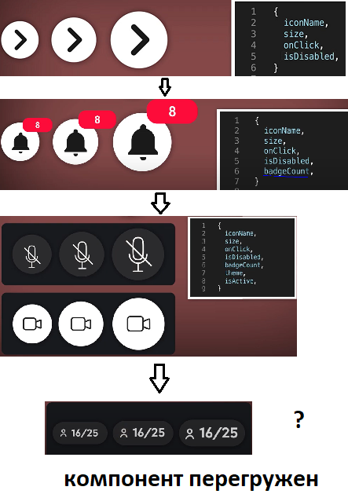
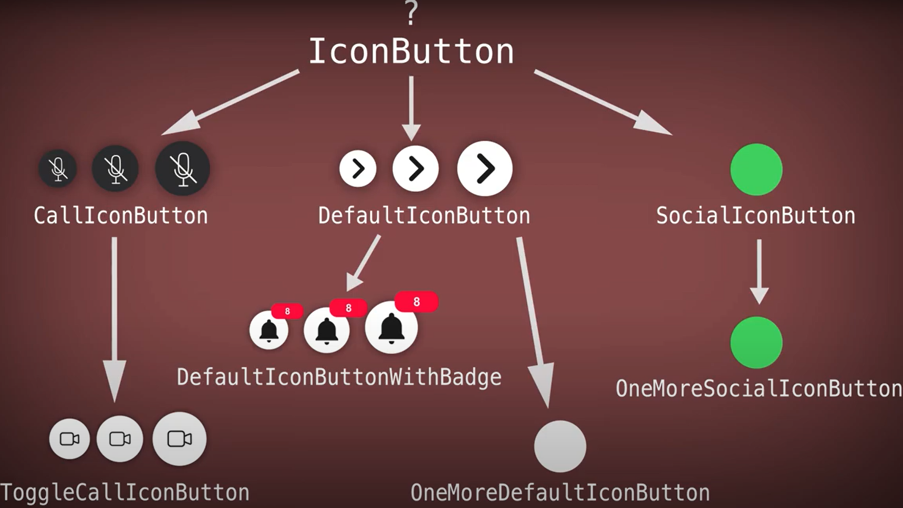
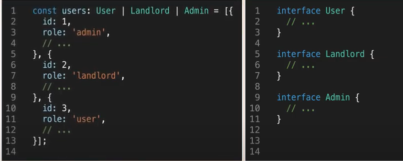

### Дескрипторы ###
Основной метод для управления свойствами – Object.defineProperty.

Он позволяет объявить свойство объекта и, что самое главное, тонко настроить его особые аспекты, которые никак иначе не изменить.

Синтаксис:

```Object.defineProperty(obj, prop, descriptor)```

Аргументы:

__obj__ - Объект, в котором объявляется свойство.
__prop__ Имя свойства, которое нужно объявить или модифицировать.
descriptor
__Дескриптор__ – объект, который описывает поведение свойства.
В нём могут быть следующие поля:

`value` – значение свойства, по умолчанию undefined.

`writable` – значение свойства можно менять, если true. По умолчанию false.

`configurable` – если true, то свойство можно удалять, а также менять его в дальнейшем при помощи новых вызовов defineProperty. По умолчанию false.

`enumerable` – если true, то свойство просматривается в цикле for..in и методе Object.keys(). По умолчанию false.

`get` – функция, которая возвращает значение свойства. По умолчанию undefined.

`set` – функция, которая записывает значение свойства. По умолчанию undefined.

Чтобы избежать конфликта, запрещено одновременно указывать значение value и функции get/set. Либо значение, либо функции для его чтения-записи, одно из двух. Также запрещено и не имеет смысла указывать writable при наличии get/set-функций.

`Object.freeze(obj)` - Запрещает добавлять/удалять/изменять свойства. Устанавливает configurable: false, writable: false для всех существующих свойств.

`Object.keys(obj)`, `Object.getOwnPropertyNames(obj)` возвращают массив – список свойств объекта.

Object.keys возвращает только enumerable-свойства.
Object.getOwnPropertyNames – возвращает все свойства

____
### TS ###

В TypeScript имеются следующие базовые типы:

`boolean`: логическое значение true или false

`number`: числовое значение

`string`: строки

`Array`: массивы

`кортежи`: [string, number]

`Enum`: перечисления

`Any`: произвольный тип

`Symbol`

`null` и `undefined`: соответствуют значениям null и undefined в javascript

`Never`: также представляет отсутствие значения и используется в качестве возвращаемого типа функций, которые генерируют или возвращают ошибку

типы от интерфейсов (расширение extand, интерфейсы могут дублироваться)
в js остаются (enum)
is: 
```
function isFish(pet: Fish | Bird): pet is Fish {
  return (pet as Fish).swim !== undefined
}
```
1 членом выражения является идентификатор, который обязан совпадать с идентификатором одного из параметров объявленных в сигнатуре функции.. Ко 2 члену выражения относится ключевое слово is, которое служит в качестве утверждения. В качестве 3 члена выражения может выступать любой тип данных.

Оператор ! (Non-Null and Non-Undefined Operator):  если разработчик в полной мере осознает последствия, то компилятор можно настоятельно попросить закрыть глаза на потенциально опасное место при помощи оператора Not-Null Not-Undefined. При обращении к полям и свойствам объекта, оператор Not-Null Not-Undefined указывается перед оператором точка object!.field.

__`as`__: когда вы используете Typescript с JSX, возможно только приведение к типу через as.
let someValue: any = "this is a string";
 
let strLength: number = (someValue as string).length;

Расширенные типы TS(утилиты): https://senior.ua/articles/shpargalka-po-bazovyh-tipah-typescript

- __`Partial<T>`__ позволяет сделать все свойства типа T необязательными. Он добавит ?отметку рядом с каждым полем.
- __`Required<T>`__ утилита делает все свойства Tнужного типа обязательными.
- __`Readonly<T>`__ Этот тип утилит преобразует все свойства типа T, чтобы сделать их не переназначаемыми с новым значением.
- __`Pick<T, K>`__ Это позволяет вам создать новый тип из существующей модели T, выбрав некоторые свойства  K этого типа. Или несколько `|`.
- __`Omit<T, K>`__ Утилита противоположность Pick типа. И вместо выбора элементов он удалит K свойства из типа T.
- __`Extract<T,U>`__ позволяет вам создать тип, выбирая общие свойства, которые представлены в двух разных типах. Утилита извлечет из Tвсех свойств, которым можно присвоить U.
- __`Exclude<T,U>`__ в отличие от этого Extract, утилита будет создавать тип, исключая свойства, которые уже присутствуют в двух разных типах. Он исключается из Tвсех полей, которым можно присвоить U.
- __`Record<K,T>`__ Эта утилита помогает вам создать тип с набором свойств K данного типа T.
- __`NonNullable<T>`__ Он позволяет снимать null и undefined с типа T.
- __`in`__ Оператор позволяет проверить , существует ли свойство x в объекте, который получен в качестве параметра.

---

паттерн делегирования 
виртуализация списков, таблиц:

react-window — это библиотека, с помощью которой можно эффективно отображать большие списки, таблицы.

FixedSizeList для длинных одномерных списков с элементами одинакового размера.
VariableSizeList - компонент для отображения списков с элементами разного размера.
Для компонента FixedSizeGrid API практически такой же, но нужно указывать значения высоты, ширины и количества элементов как для столбцов, так и для строк.
Для компонента VariableSizeGrid можно изменять ширину столбцов и высоту строк, передавая функции, а не значения в соответствующие свойства этого компонента.

---

dry - Don’t repeat yourself (не повторяйся). Самый простой подход по уменьшению сложности — разделить систему на управляемые части. Каждая часть знания должна иметь единственное, непротиворечивое и авторитетное представление в рамках системы. Изменение единственного элемента системы не требует внесения изменений в другие, логически не связанные элементы. Те элементы, которые логически связаны, изменяются предсказуемо и единообразно.

kiss - keep it simple stupid (делайте вещи проще). Самое простое объяснение является самым правильным решением.
-не имеет смысла реализовывать дополнительные функции, которые не будут использоваться.
-не стоит подключать огромную библиотеку, если вам от неё нужна лишь пара - функций;
- не имеет смысла беспредельно увеличивать уровень абстракции, надо уметь вовремя остановиться;


#### Solid: ####
__S__: Single Responsibility Principle (__Принцип единственной ответственности__) 
(Магическая кнопка - антипаттерн, каждый компонент отвечает за свою логику).

Чтобы наши компоненты выполняли одно действие, мы можем:

- разбить большие компоненты, которые делают слишком много, на более мелкие компоненты;
- выделить код, не связанный с функциональностью основного компонента, в отдельные служебные функции;
- инкапсулировать подключенную функциональность в настраиваемые хуки.


__O__: Open-Closed Principle (__Принцип открытости-закрытости__).
Код должен быть открыт для расширения, но закрыт для модификации. Пример API новое значение для свойства.
> Пример: применение компоновки `Children`, или доп. пропсов.


__L__: Liskov Substitution Principle (__Принцип подстановки Барбары Лисков__).
Функции, которые используют базовый тип, должны иметь возможность использовать подтипы базового типа, не зная об этом.
В реакт прпустим...?
 
(Родительский класс можно заменить дочерним.+-одинаковые методы.)

Современная идея принципа может выглядеть так:


Когда становится сложно расширять компонент, стоит выделить в отдельные компоненты

Для сохранения принципа подстановки Б.Лисков можно создать файл со стилями и вызывать его в 2 отдельных компонентах.


__I__: Interface Segregation Principle (__Принцип разделения интерфейсов__).
'Клиенты' не должны реализовывать методы, интерфесы которые они не используют.
Принцип разделения интерфейса выступает за минимизацию зависимостей между компонентами системы, делая их менее связанными и, следовательно, более пригодными для повторного использования.


Или
> В случае React: «компоненты не должны зависеть от пропсов, которые они не используют».

__D__: Dependency Inversion Principle (__Принцип инверсии зависимостей__). 
Модули и подмодули не должны зависить друг от друга, а должны зависеть от абстракций.

> Пример - использование HOC или хуки. 

Принцип инверсии зависимостей направлен на минимизацию связи между различными компонентами приложения.

---

Архитектура паттерна __Singleton__ основана на идее использования глобальной переменной, имеющей следующие важные свойства:

Такая переменная доступна всегда. Время жизни глобальной переменной - от запуска программы до ее завершения.
Предоставляет глобальный доступ, то есть, такая переменная может быть доступна из любой части программы.


__Фабрика__ - функция, которая возвращает разные реализации интерфейса на основе входных параметров.
__Абстрактная фабрика__ - фабрика фабрик.
__Фасад__ - реализацию процесса делим на функции(этапы). Для алгоритма определяем функцию в которой вызываются все функции этапов. Но мы также можем вызывать функции по отдельности для реализации части алгоритма, либо другого алгоритма.

